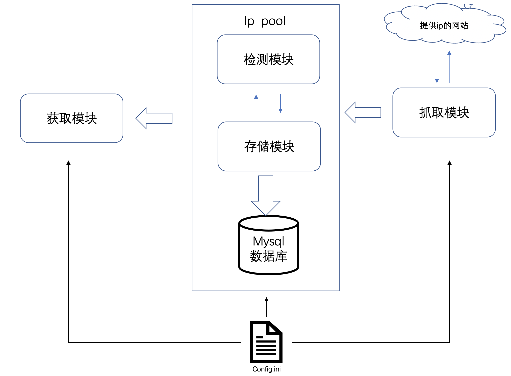
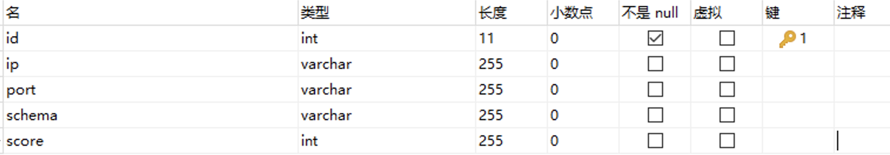

# proxy  pool




如图所示，proxy pool项目由四大模块组成：

1. 抓取模块：负责从各大免费ip提供网站上抓取ip地址，将抓取下来的ip传递给 ip pool。
2. 检测模块：主要负责ip的有效性检测，其作用主要为过滤和定时检测
   * 过滤：当抓取模块将抓取下来的 ip 存入 ip pool时，检测模块对存入的ip进行有效性检测。
   * 定时检测：定时对数据库中的已经存入的ip进行有效性检测，如果ip失效则进行扣分，当ip分数低于某个阈值，则将其从数据库中删除。
3. 存储模块：使用mysql数据库对有效ip进行存取
4. 获取模块：时刻监控用户的请求，当用户发起请求时，从数据库中获取分数最高的ip进行返回。

## 抓取模块


## 检测模块


##存储模块

mysql数据库表设计如下图：



```
DROP TABLE IF EXISTS `proxy_pool`;
CREATE TABLE `proxy_pool`  (
  `id` int(11) NOT NULL AUTO_INCREMENT,
  `ip` varchar(255) CHARACTER SET utf8mb4 COLLATE utf8mb4_0900_ai_ci NULL DEFAULT NULL,
  `port` varchar(255) CHARACTER SET utf8mb4 COLLATE utf8mb4_0900_ai_ci NULL DEFAULT NULL,
  `schema` varchar(255) CHARACTER SET utf8mb4 COLLATE utf8mb4_0900_ai_ci NULL DEFAULT NULL,
  `score` int(255) NULL DEFAULT NULL,
  PRIMARY KEY (`id`) USING BTREE
) ENGINE = InnoDB CHARACTER SET = utf8mb4 COLLATE = utf8mb4_0900_ai_ci ROW_FORMAT = Dynamic;

SET FOREIGN_KEY_CHECKS = 1;
```


## 获取模块


1. check_proxy.py：用于检测mysql数据库中的ip是否可用，如果可用，则将该代理ip的分值+5，最多分值可以加到100，如果不可用，代理ip的分值每次-10，当代理ip的分值为0的时候，从mysql数据控中删除该代理ip。
2. db_utils.py: 主要是对代理进行mysql增删改的函数
3. crawler.py : 以crawl开头的函数是爬取代理网站（规则）的具体实现，
4. getter.py : 主要是调用crawler.py 中以crawl开头的函数，对各个代理网站的ip进行爬取。
5. webapi.py : 主要是以网站的形式，给用户提供代理ip。比如：通过在浏览器输入：127.0.0.1:5000/random，会返回一个分值相对较高的代理 （分值越高，代理的可用性越强）。也可以运行在服务器上，给其他用于提供代理
6. utils.py: 主要是用于获取页面源码，获取页面中ip的规则写在crawler.py中
7. scheduler.py : 使用三个线程跑getter.py(获取)，check_proxy.py(检查代理)，webapi.py(提供代理)。也可以分别运行getter.py,check_proxy.py,webapi.py.
8. config.ini:整个项目的配置文件：


